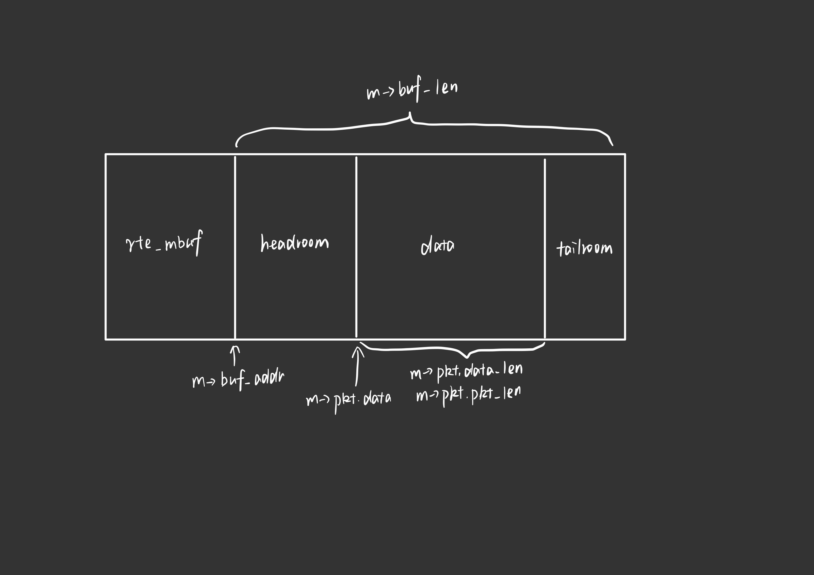

# lab2

---

## <font color="red">part1</font>

#### Q1: What's the purpose of using hugepage?
&emsp;&emsp;TLB 大小是很有限的，随着程序的变大或者程序使用内存的增加，那么势必会增加 TLB 的 使用项，最后导致 TLB 出现不命中的情况。那么，在这种情况下，大页的优势就显现出来 了。如果采用 2MB 作为分页的基本单位，那么只需要一个表项就可以保证不出现 TLB 不命 中的情况；对于消耗内存以 GB（230）为单位的大型程序，可以采用 1GB 为单位作为分页的 基本单位，减少 TLB 不命中的情况。

#### Q2: Take examples/helloworld as an example, describe the execution flow of DPDK programs?
1. 初始化基础运行环境
2. 多核运行初始化
3. 通过rte_eal_remote_launch在每个lcore上，启动被指定的线程，在master lcore上也运行函数
5. 等待所有线程执行结束

#### Q3: Read the codes of examples/skeleton, describe DPDK APIs related to sending and receiving packets.
1. 收包
```c++
static inline uint16_t rte_eth_rx_burst(uint8_t port_id, uint16_t queue_id, struct rte_mbuf **rx_pkts, const uint16_t nb_pkts)
```
2. 发包
```c++
static inline uint16_t rte_eth_tx_burst(uint8_t port_id, uint16_t queue_id, struct rte_mbuf **tx_pkts, uint16_t nb_pkts)
```
&emsp;&emsp;参数分别代表端口号、队列号、包的buffer(二维数组)、包的数量
&emsp;&emsp;返回值为实际上发包或收包的数量

#### Q4: Describe the data structure of 'rte_mbuf'.
&emsp;&emsp;rte_mbuf中包含buf_addr、buf_len、data_off、refcnt等字段
&emsp;&emsp;在rte_mbuf结构体后面的依次是headroom、data和tailroom，buf_addr指向headroom，pkt.data则指向data



+ buf_addr：当前mbuf的虚拟地址，标准buf_addr的指向的内存是在mbuf头部开始，偏移一个mbuf头加上一个私有数据的大小(headroom地址)
+ buf_len：headroom、data和tailroom总长度
+ data_off：标识mbuf的data room开始地址到报文起始位置的偏移，默认是设置为RTE_PKTMBUF_HEADROOM(128)
+ refcnt：用来表示mbuf被引用的次数，在mbuf被释放的时候，需要检查，确定引用计数只能为1，否则报错
+ mbuf分段存储
    - nb_segs：表示当前的mbuf报文有多少个分段
    - next 表示下一个分段的地址，单向链表连接
+ ol_flags：卸载特性标识，按bit的组合来表示特定的含义
+ port：表示输入输出端口号，无效值是UINT16_MAX
+ packet_type：主要用来表示报文的L2/L3/L4 and tunnel information

---

## <font color="red">part2</font>

&emsp;&emsp;根据part1中对rte_eth_tx_burst函数的分析，需要创建二维数组来储存packets，。再根据struct rte_ether_hdr、struct rte_ipv4_hdr和struct rte_udp_hdr的结构，构造packets
&emsp;&emsp;以下为核心代码

```c++
struct rte_mbuf* tx_pkts[BURST_SIZE]; //buffer of packets 
for (int i=0; i<BURST_SIZE; i++)
{   
    tx_pkts[i] = rte_pktmbuf_alloc(mbuf_pool);
    
    struct rte_ether_hdr* eth_hdr = rte_pktmbuf_mtod(tx_pkts[i], struct rte_ether_hdr*);
    struct rte_ipv4_hdr* ip_hdr = (struct rte_ipv4_hdr*)(rte_pktmbuf_mtod(tx_pkts[i], char*) 
                                    + sizeof(struct rte_ether_hdr));
    struct rte_udp_hdr* udp_hdr = (struct rte_udp_hdr*)(rte_pktmbuf_mtod(tx_pkts[i], char*) 
                                    + sizeof(struct rte_ether_hdr) + sizeof(struct rte_ipv4_hdr));
    int* data = (int*)(rte_pktmbuf_mtod(tx_pkts[i], char*) + sizeof(struct rte_ether_hdr) 
                                    + sizeof(struct rte_ipv4_hdr) + sizeof(struct rte_udp_hdr));

    struct rte_ether_addr d_addr = {{0x14, 0x02, 0xEC, 0x89, 0x8D, 0x24}};
    struct rte_ether_addr s_addr = {{0x14, 0x02, 0xEC, 0x89, 0xED, 0x54}};

    eth_hdr->d_addr = d_addr;                                   /**< Destination address. */
    eth_hdr->s_addr = s_addr;                                   /**< Source address. */
    eth_hdr->ether_type = 0x0008;                               /**< Frame type. */

    ip_hdr->version_ihl = RTE_IPV4_VHL_DEF;                     /**< version and header length */
    ip_hdr->type_of_service = RTE_IPV4_HDR_DSCP_MASK;           /**< type of service */
    ip_hdr->total_length = 0x2000;                              /**< length of packet */
    ip_hdr->packet_id = 0;                                      /**< packet ID */
    ip_hdr->fragment_offset = 0;                                /**< fragmentation offset */
    ip_hdr->time_to_live = 100;                                 /**< time to live */
    ip_hdr->next_proto_id = 17;                                 /**< protocol ID */
    ip_hdr->hdr_checksum = rte_ipv4_cksum(ip_hdr);              /**< header checksum */
    ip_hdr->src_addr = 0;                                       /**< source address */
    ip_hdr->dst_addr = 0;                                       /**< destination address */

    udp_hdr->src_port = 0x1234;                                     /**< UDP source port. */
    udp_hdr->dst_port = 0x5678;                                   /**< UDP destination port. */
    udp_hdr->dgram_len = 0x0c00;                                /**< UDP datagram length */
    udp_hdr->dgram_cksum = 1;                                   /**< UDP datagram checksum */

    *data = i;
    tx_pkts[i]->data_len = sizeof(struct rte_ether_hdr) + sizeof(struct rte_ipv4_hdr) 
                        + sizeof(struct rte_udp_hdr) + sizeof(int);
    tx_pkts[i]->pkt_len = sizeof(struct rte_ether_hdr) + sizeof(struct rte_ipv4_hdr) 
                        + sizeof(struct rte_udp_hdr) + sizeof(int);
}
    
uint16_t nb_tx = rte_eth_tx_burst(0, 0, tx_pkts, BURST_SIZE);
```
.png)

&emsp;&emsp;根据观察，是小端机，调整参数的顺序与包中顺序一致。修改eth_hdr->d_addr和eth_hdr->s_addr，发现报错

.png)

&emsp;&emsp;继续修改ip_hdr->packet_id = i，ip_hdr->fragment_offset = i，发现protocal变为IPv4

.png)

### 对细节的分析
+ ether、ip、udp三层一层都不能少
+ 注意大小端，否则会有错
+ 在rte_ip.h中有ip的checksum函数，但是rte_udp.h中没有udp的checksum函数，于是随便写了个0